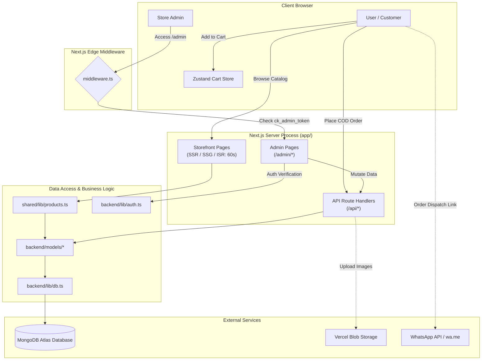

# CuffKings — Current Architecture, File Structure & Refactoring Blueprint

> **Generated**: October 2026  
> **Status**: Ready for Refactoring & Deployment Preparation  
> **Current Build Status**: ✅ Passing (`next build` compiled 87 static & dynamic routes with zero TypeScript errors)

---

## 1. Executive Summary & Tech Stack Overview

**CuffKings** is built as a unified **Full-Stack Next.js 15 Monolith** using the **App Router**, designed for a luxury men's cufflinks brand operating out of Peshawar, Pakistan. The site combines a high-aesthetic storefront (*Noir Atelier* design system) with an integrated administrative control plane and API endpoints.

### Core Technology Stack

| Layer | Technology | Details / Role |
|---|---|---|
| **Framework** | Next.js 15.1.6 (App Router) | Unified SSR, SSG, ISR (60s revalidation), and Serverless API routes |
| **Runtime / UI** | React 19.0.0 + TypeScript 5 | Modern React 19 Server & Client Components with strict typing |
| **Styling** | Tailwind CSS 3.4.1 + Vanilla CSS | Custom Noir Atelier theme (`#080808` obsidian, `#c5a059` champagne brass) |
| **Animations** | GSAP 3.15.0 | Kinetic hero reveal, magnetic buttons, custom cursor, smooth transitions |
| **State Management**| Zustand 5.0.2 | Persistent client-side cart (`cartStore.ts`) saved in `localStorage` |
| **Database** | MongoDB Atlas via Mongoose 9.10.3 | Document database with serverless connection pooling & caching |
| **Authentication** | JWT (`jsonwebtoken 9.0.3`) + `bcryptjs` | HttpOnly cookie-based session verification (`ck_admin_token`) |
| **Route Protection**| Next.js Edge Middleware (`middleware.ts`) | Intercepts all `/admin/*` routes; enforces login redirect |
| **Commerce Model** | Hybrid Checkout | MongoDB Order persistence + WhatsApp Direct Order Dispatch |
| **Media / Storage** | Local `/public` + `@vercel/blob` | Product images served locally, with Vercel Blob cloud upload support |

---

## 2. Complete File & Directory Inventory

Below is the complete directory structure of the repository.

```
cufflinks website/
├── .env.example                               # Environment template
├── .env.local                                 # Local secrets (MongoDB URI, JWT secret, etc.)
├── .eslintrc.json                             # ESLint configuration
├── .gitignore                                 # Git ignore rules
├── middleware.ts                              # Next.js Edge middleware protecting /admin routes
├── next.config.ts                             # Next.js config (remote image patterns, build tuning)
├── package.json                               # Dependencies and npm scripts
├── postcss.config.mjs                         # PostCSS configuration for Tailwind
├── tailwind.config.ts                         # Noir Atelier luxury color tokens & font scales
├── tsconfig.json                              # TypeScript compiler settings & path aliases
│
├── app/                                       # NEXT.JS 15 APP ROUTER (Pages & API Handlers)
│   ├── globals.css                            # Global CSS variables & typography imports
│   ├── icon.tsx                               # Dynamic SVG favicon generator
│   ├── layout.tsx                             # Root HTML layout (Navbar, Footer, CartDrawer, Fonts)
│   ├── not-found.tsx                          # Branded 404 error page
│   ├── opengraph-image.tsx                    # Dynamic OpenGraph social share card
│   ├── page.tsx                               # Homepage (Hero, Brand Story, Featured Products)
│   │
│   ├── about/
│   │   └── page.tsx                           # Brand heritage, atelier story & craftsmanship
│   ├── cart/
│   │   └── page.tsx                           # Dedicated full-page cart
│   ├── checkout/
│   │   └── page.tsx                           # Checkout form (COD + WhatsApp order confirmation)
│   ├── contact/
│   │   └── page.tsx                           # Contact channels, inquiries, dynamic FAQ
│   │
│   ├── shop/
│   │   ├── page.tsx                           # Full product catalog with filter sidebar
│   │   └── [category]/
│   │       └── page.tsx                       # Category filtered catalog (Classical/Signature/Premium)
│   │
│   ├── product/
│   │   └── [slug]/
│   │       └── page.tsx                       # Product detail page (ISR revalidate = 60s)
│   │
│   ├── admin/                                 # ADMIN BACKOFFICE UI
│   │   ├── layout.tsx                         # Admin layout (Sidebar navigation & auth check)
│   │   ├── page.tsx                           # Admin dashboard (Metrics, stats, alerts)
│   │   ├── login/
│   │   │   └── page.tsx                       # Admin login page (Passcode / bcrypt check)
│   │   ├── collections/
│   │   │   └── page.tsx                       # Tier management (Classical, Signature, Premium)
│   │   ├── content/
│   │   │   └── page.tsx                       # CMS copy editor (Hero copy, FAQs, Delivery fees)
│   │   ├── orders/
│   │   │   └── page.tsx                       # Order management & courier tracking table
│   │   └── products/
│   │       ├── page.tsx                       # Product inventory list
│   │       ├── new/
│   │       │   └── page.tsx                   # Add new product form
│   │       └── [id]/
│   │           └── edit/
│   │               └── page.tsx               # Edit existing product
│   │
│   └── api/                                   # SERVERLESS API ENDPOINTS
│       ├── admin-login/
│       │   └── route.ts                       # POST login (sets cookie) / DELETE logout
│       ├── collections/
│       │   └── route.ts                       # GET tiers / PUT update tier configurations
│       ├── content/
│       │   └── route.ts                       # GET site copy / PUT update content
│       ├── orders/
│       │   ├── route.ts                       # GET orders list / POST customer order
│       │   └── [id]/
│       │       └── route.ts                   # PATCH order status & tracking / DELETE order
│       └── products/
│           ├── route.ts                       # GET filtered products / POST create product
│           └── [id]/
│               └── route.ts                   # GET single / PUT update / DELETE product
│
├── frontend/                                  # FRONTEND COMPONENTS & CLIENT STATE
│   ├── store/
│   │   └── cartStore.ts                       # Zustand cart store with localStorage persistence
│   └── components/
│       ├── about/
│       │   └── CollectionExplainer.tsx        # About page collection tier explanations
│       ├── cart/
│       │   ├── CartDrawer.tsx                 # Flyout slide-over cart panel
│       │   ├── CartItem.tsx                   # Individual item row inside drawer
│       │   └── CartSummary.tsx                # Subtotal, delivery fee calculation & checkout CTA
│       ├── checkout/
│       │   └── CheckoutForm.tsx               # Form validation (Zod) & order submission
│       ├── contact/
│       │   ├── ContactChannels.tsx            # WhatsApp, phone, email, atelier location
│       │   ├── ContactFAQ.tsx                 # Accordion FAQs fetched from SiteContent
│       │   ├── ContactHero.tsx                # Editorial header for contact page
│       │   └── ContactInquiryForm.tsx         # Quick pre-filled inquiry form
│       ├── home/
│       │   ├── BrandStory.tsx                 # Peshawar atelier heritage editorial section
│       │   ├── BrandTicker.tsx                # Luxury marquee text bar
│       │   ├── CategoryGrid.tsx               # 3-tier card preview (Classical, Signature, Premium)
│       │   ├── CollectionIntro.tsx            # Editorial typography showcase
│       │   ├── FeaturedCollectionsShowcase.tsx# Tabbed collection browser
│       │   ├── FeaturedProducts.tsx           # Grid of highlighted cufflinks
│       │   ├── FeaturedProductStory.tsx       # Spotlight product with deep-dive craftsmanship details
│       │   ├── FinalCTA.tsx                   # Bottom call to action banner
│       │   ├── HeroNoir.tsx                   # Full-viewport GSAP animated hero
│       │   ├── HorizontalCollection.tsx       # Horizontal scrolling showcase
│       │   ├── MoreAboutCufflinks.tsx         # Style guide & cufflink etiquette
│       │   └── ProcessDetails.tsx             # Craftsmanship, casting, and polishing breakdown
│       ├── layout/
│       │   ├── Navbar.tsx                     # Main navigation, search toggle, and cart trigger
│       │   └── Footer.tsx                     # Atelier footer, legal links, newsletter, social
│       ├── motion/
│       │   ├── CountUp.tsx                    # Animated numeric counter for stats
│       │   ├── CustomCursor.tsx               # Luxury magnetic mouse cursor
│       │   ├── HorizontalScroll.tsx           # GSAP horizontal scroll container
│       │   ├── ImageReveal.tsx                # Curtain reveal on image view
│       │   ├── Magnetic.tsx                   # Physics-based magnetic hover on buttons
│       │   ├── Marquee.tsx                    # Smooth ticker banner
│       │   ├── PageTransition.tsx             # Route change wipe animation
│       │   ├── Parallax.tsx                   # Scroll parallax container
│       │   ├── Reveal.tsx                     # Scroll-triggered fade & rise animation
│       │   ├── ScrollProgress.tsx             # Slim top scroll progress bar
│       │   └── SplitReveal.tsx                # Character/word split animation
│       ├── product/
│       │   ├── AddToCartButton.tsx            # Quantity selector + cart add with toast
│       │   ├── ImageGallery.tsx               # Main image switcher & thumbnail carousel
│       │   └── ProductMedia.tsx               # Optimized image renderer with zoom preview
│       ├── shop/
│       │   ├── FilterSidebar.tsx              # Dynamic filtering (Category, Price, Material, Finish)
│       │   ├── ProductCard.tsx                # Standard product card with hover effect & badge
│       │   ├── ProductGrid.tsx                # Responsive CSS grid for products
│       │   └── ShopHeader.tsx                 # Category banner, item counter, sort dropdown
│       └── ui/
│           ├── Badge.tsx                      # Sale, Limited Edition, New Arrival tags
│           ├── BrassLine.tsx                  # Champagne brass metallic horizontal hairline divider
│           ├── Button.tsx                     # Primary, Secondary, Outline & Ghost luxury buttons
│           ├── ProductPlaceholder.tsx         # Monogram SVG fallback when image fails
│           └── StitchDivider.tsx              # Tailored stitching graphic accent
│
├── backend/                                   # BACKEND SERVER LOGIC & ADMIN UI (⚠️ Structural Smell)
│   ├── lib/
│   │   ├── auth.ts                            # JWT verification, password hashing, admin session
│   │   ├── db.ts                              # Mongoose connection manager with singleton cache
│   │   └── validators.ts                      # Re-exports Zod validators from shared
│   ├── models/
│   │   ├── CollectionSettings.ts              # Mongoose schema for collection tiers
│   │   ├── Order.ts                           # Mongoose schema for customer orders
│   │   ├── Product.ts                         # Mongoose schema for cufflinks catalog
│   │   └── SiteContent.ts                     # Mongoose schema for dynamic site copy & FAQs
│   └── admin-components/                      # ⚠️ React UI components located inside backend/
│       ├── AdminSidebar.tsx                   # Admin navigation sidebar
│       ├── CollectionEditor.tsx               # Form for editing tier descriptions & prices
│       ├── ImageUploader.tsx                  # Vercel Blob / URL image upload manager
│       ├── OrderTable.tsx                     # Searchable order grid with status updates
│       ├── ProductForm.tsx                    # Multi-tab create/edit product form
│       ├── ProductTable.tsx                   # Product catalog manager with quick actions
│       └── SiteContentForm.tsx                # Content CMS form for hero, FAQs, contact info
│
├── shared/                                    # CROSS-CUTTING LOGIC & TYPES
│   ├── types/
│   │   ├── collection.ts                      # Collection tier TypeScript definitions
│   │   ├── product.ts                         # Product, Category, StockStatus interfaces
│   │   └── siteContent.ts                     # CMS SiteContent TypeScript interfaces
│   └── lib/
│       ├── products.ts                        # ⚠️ Database query helper (imports backend models!)
│       ├── validators.ts                      # Zod validation schemas for products, orders, login
│       ├── whatsapp.ts                        # WhatsApp checkout & inquiry message generator
│       └── hooks/
│           └── useReducedMotion.ts            # Accessibility hook to disable GSAP animations
│
├── scripts/                                   # UTILITY & SEEDING SCRIPTS
│   ├── build-seed.js                          # Build helper script
│   ├── seed-products.ts                       # Populates MongoDB Atlas with 80+ cufflink items
│   ├── seed-site-data.ts                      # Populates collection settings & site content
│   └── verify-backend.ts                      # Automated backend & API test suite (Passes 100%)
│
├── public/                                    # STATIC ASSETS
│   ├── editorial/                             # Atelier craftsmanship photos (3 files)
│   └── products/                              # 80+ high-resolution product images (JPEGs)
│
└── docs/                                      # PROJECT DOCUMENTATION
    ├── ARCHITECTURE.md                        # Previous architecture notes
    ├── CUFFKINGS_MASTER_BLUEPRINT.md          # Business & feature specifications
    ├── DESIGN.md                              # Noir Atelier visual design manual
    ├── COMPONENTS_REFERENCE.md                # Component inventory & props
    └── archive/                               # Older documentation snapshots
```

---

## 3. Data Flow & Request Lifecycle



### Key Lifecycle Highlights
1. **Dynamic ISR Storefront**: Pages like `/product/[slug]` and `/shop/[category]` are statically pre-rendered at build time (87 static pages) and dynamically revalidated every 60 seconds (`export const revalidate = 60;`), ensuring blazing fast loads with instant database freshness.
2. **Edge Route Protection**: `middleware.ts` runs at the Edge, checking the `ck_admin_token` cookie. Unauthenticated visitors attempting to access `/admin/*` are immediately redirected to `/admin/login` before any server components render.
3. **Database Caching**: `backend/lib/db.ts` preserves a global singleton Mongoose connection to prevent connection exhaustion in serverless environments (e.g., Vercel Lambdas).
4. **Order Redundancy**: Orders placed at `/checkout` are saved to MongoDB via `/api/orders` AND formatted into a pre-filled WhatsApp message for customer confirmation.

---

## 4. Architectural Analysis: Inconsistencies & Flaws

Before deploying the site to production, several structural and design flaws should be addressed:

### ⚠️ Flaw 1: UI Components Placed Inside `backend/`
- **What is wrong**: `backend/admin-components/` contains 7 React UI components (`AdminSidebar.tsx`, `ProductForm.tsx`, `OrderTable.tsx`, etc.).
- **Impact**: In web engineering, anything rendering HTML/JSX and executing in the browser is **Frontend UI**. Placing UI inside `backend/` creates severe confusion, violates separation of concerns, and forces `tailwind.config.ts` to scan `./backend/admin-components/**/*.{js,ts,jsx,tsx}`.
- **Solution**: Move `backend/admin-components/` into `frontend/components/admin/` or `components/admin/`.

### ⚠️ Flaw 2: Cross-Layer Dependency Violations in `shared/`
- **What is wrong**:
  - `shared/lib/products.ts` directly imports `backend/lib/db.ts` and `backend/models/Product.ts`.
  - `shared/lib/whatsapp.ts` imports from `@/frontend/store/cartStore.ts`.
- **Impact**: A "shared" directory is supposed to be usable by **both** the browser and server. Because `shared/lib/products.ts` imports Mongoose, importing it in any Client Component (`"use client"`) will cause webpack to crash with `Module not found: Can't resolve 'net' / 'tls' / 'dns'`.
- **Solution**: Split server-only data access helpers into `lib/server/` or `backend/repositories/`, leaving `shared/` strictly for universal code (Zod schemas, types, string formatters).

### ⚠️ Flaw 3: Redundant & Cluttered Root Markdown Files
- **What is wrong**: There are currently 9 separate markdown summary files at the root of the project:
  - `ARCHITECTURE_CLARIFICATION.md`
  - `GIT_COMMIT_SUCCESS.md`
  - `HOW_TO_RUN_THE_WEBSITE.md`
  - `QUICK_START_GUIDE.md`
  - `README.md`
  - `SOLUTION_SUMMARY.md`
  - `SYSTEM_ARCHITECTURE.md`
  - `WEBSITE_STATUS_FINAL.md`
  - `COMMIT_MESSAGE.txt`
- **Impact**: Makes the project root messy and confusing for collaborators and CI/CD pipelines.
- **Solution**: Keep only `README.md` at root; archive or consolidate historical status docs into `docs/archive/`.

### ⚠️ Flaw 4: Critical Security Backdoors Before Deployment
- **What is wrong in `backend/lib/auth.ts`**:
  ```typescript
  // Line 5: Insecure fallback JWT secret
  const getJwtSecret = () => process.env.JWT_SECRET || "default_jwt_secret_cuffkings_fallback_2026";

  // Line 13: Hardcoded master password
  if (hash === plain || plain === "cuffkings2026!") {
    return true;
  }
  ```
- **Impact**: In production, anyone knowing the string `"cuffkings2026!"` can bypass bcrypt authentication and log into the admin panel. If `JWT_SECRET` is unset, tokens can be forged using the fallback string.
- **Solution**: Remove the hardcoded password fallback before go-live, and require `JWT_SECRET` to be strictly defined in production.

### ⚠️ Flaw 5: Local Image Assets in Git Repository
- **What is wrong**: Over 80 high-resolution `.jpeg` images (~50MB+) are stored inside `public/products/`.
- **Impact**: Storing dozens of full-size images directly in Git leads to repository bloat and slower deployments on platforms like Vercel.
- **Solution**: The app already includes `@vercel/blob` support and `ImageUploader.tsx`. For enterprise production, product photography should be hosted on Vercel Blob, Cloudinary, or AWS S3.

---

## 5. Recommended Refactoring Blueprint

To improve this structure while minimizing risk before deployment, you have two clear paths:

### Option A: Clean Modular Root Structure (Lowest Risk — Recommended)
Keeps the existing Next.js App Router root layout while fixing component organization and boundary violations:

```
cufflinks website/
├── app/                               # Next.js App Router (Storefront, Admin, API)
├── components/                        # UNIFIED UI LAYER (Merged frontend & backend UI)
│   ├── admin/                         # Formerly backend/admin-components/
│   │   ├── AdminSidebar.tsx
│   │   ├── OrderTable.tsx
│   │   ├── ProductForm.tsx
│   │   └── ...
│   ├── storefront/                    # Formerly frontend/components/
│   │   ├── cart/
│   │   ├── checkout/
│   │   ├── home/
│   │   ├── layout/
│   │   └── shop/
│   ├── motion/                        # GSAP & animation primitives
│   └── ui/                            # Buttons, Badges, Dividers
├── lib/                               # CORE LOGIC & HELPERS
│   ├── client/                        # Client-only utilities (whatsapp.ts, cart helpers)
│   ├── server/                        # Server-only utilities (auth.ts, db.ts, queries)
│   └── validators/                    # Universal Zod schemas
├── models/                            # Mongoose Schemas (Collection, Order, Product, Content)
├── store/                             # Zustand state (cartStore.ts)
├── types/                             # All TypeScript interfaces
├── public/                            # Static assets
├── scripts/                           # Database seed & test scripts
└── docs/                              # Project documentation
```

### Option B: Next.js Standard `src/` Architecture (Industry Standard)
The standard modern structure used by the Next.js community for production applications:

```
cufflinks website/
├── src/
│   ├── app/                           # App Router
│   ├── components/                    # All UI components (admin, storefront, ui)
│   ├── lib/                           # Server & client utilities
│   ├── models/                        # Mongoose schemas
│   ├── store/                         # Zustand state
│   └── types/                         # TypeScript interfaces
├── public/                            # Static assets
├── scripts/                           # Maintenance & migration scripts
├── docs/                              # Documentation
├── next.config.ts
└── tailwind.config.ts
```

---

## 6. Pre-Deployment Checklist

Before deploying to Vercel, Railway, or AWS:

- [x] **TypeScript Validation**: `npx tsc --noEmit` runs with 0 errors.
- [x] **Production Build**: `npm run build` compiles with 0 errors (all 87 routes generated).
- [ ] **Clean Root Directory**: Move extra `.md` status files into `docs/archive/`.
- [ ] **Fix Admin Components Location**: Move `backend/admin-components/` into `frontend/components/admin/` or `components/admin/`.
- [ ] **Hardcoded Credential Removal**: Remove `"cuffkings2026!"` and fallback JWT strings from `backend/lib/auth.ts`.
- [ ] **Environment Variables Configuration**:
  - `MONGODB_URI`: Atlas production connection string.
  - `JWT_SECRET`: 64-character random string (`openssl rand -hex 32`).
  - `ADMIN_PASSWORD_HASH`: Production bcrypt hash of admin password.
  - `NEXT_PUBLIC_WHATSAPP_NUMBER`: Verified business WhatsApp number (e.g., `923719145871`).
  - `BLOB_READ_WRITE_TOKEN`: Vercel Blob access token (for cloud image uploads).
- [ ] **MongoDB Atlas Network Security**: Ensure Atlas IP Access List includes `0.0.0.0/0` (allowing Vercel dynamic serverless IP connections).
- [ ] **Robots.txt & Sitemap.xml**: Add static/dynamic sitemap in `/app/sitemap.ts` and `/app/robots.ts` for Google search indexing.
