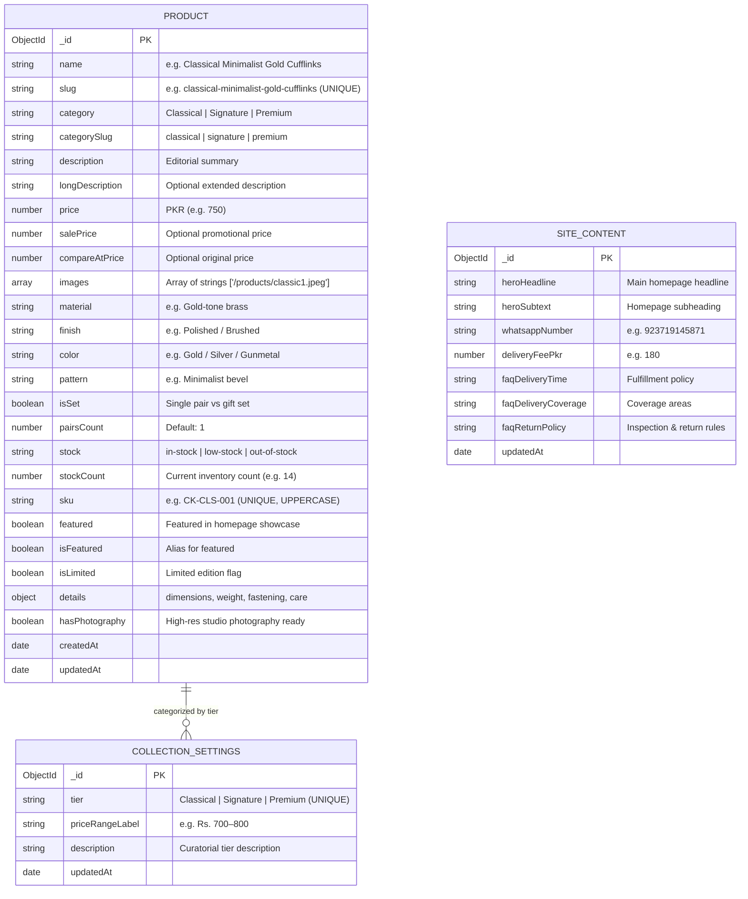
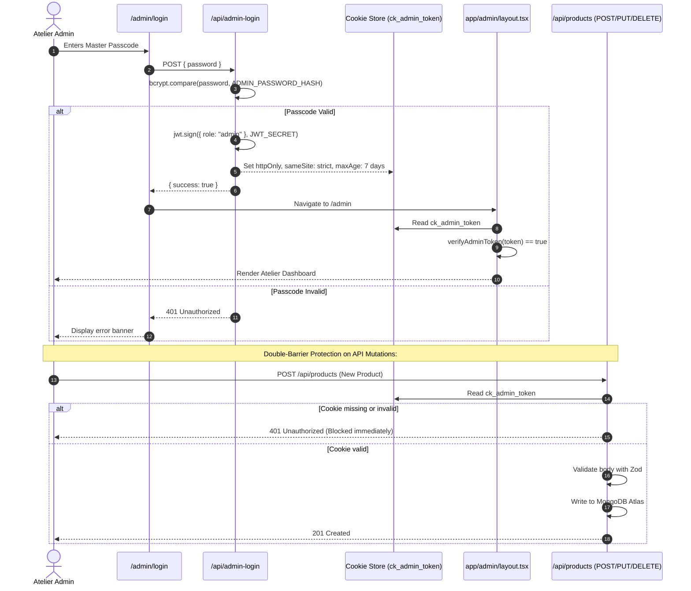
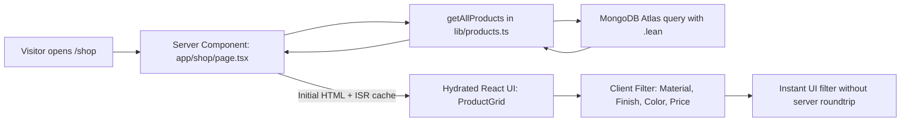

# CuffKings — System Architecture & Technical Blueprint

> **Purpose of this Document**:  
> This file is the complete, single-source-of-truth guide to understanding how the CuffKings platform works under the hood. It explains the system design, file structure, data flow, authentication model, and provides a clear roadmap to eliminate architectural confusion and improve the codebase.

---

## 1. High-Level Architecture Overview

CuffKings is a modern, unified full-stack application built on **Next.js 15 (App Router)**. It serves two distinct personas from a single codebase and deployment:

1. **The Public Storefront**: High-performance, luxury e-commerce experience showcasing artisan cufflinks with cinematic GSAP animations, ISR caching, dynamic filtering, and a dual checkout experience (WhatsApp Direct & Cash-on-Delivery).
2. **The Atelier Admin Portal (`/admin`)**: A password-protected management console for viewing inventory analytics, updating catalog items, uploading photography paths, modifying site copy, and managing pricing tiers.

```mermaid
graph TD
    subgraph Client Browser
        StorefrontUI["Public Storefront (/shop, /product/[slug])"]
        AdminUI["Atelier Admin UI (/admin, /admin/products)"]
        CartZustand["Zustand Cart Store (LocalStorage)"]
    end

    subgraph Next.js 15 Full-Stack Server
        Middleware["Next.js Middleware (x-pathname header)"]
        AdminLayout["Admin Layout Gate (Cookie Validation)"]
        
        subgraph Server Components (Direct DB Access)
            HomeSSR["Home Page (app/page.tsx)"]
            ShopSSR["Shop Page (app/shop/page.tsx)"]
            DetailSSR["Product Detail (app/product/[slug]/page.tsx)"]
            AdminDashboard["Admin Dashboard (app/admin/page.tsx)"]
        end

        subgraph REST API Endpoints (JSON)
            AuthAPI["/api/admin-login (POST/DELETE)"]
            ProductsAPI["/api/products & /api/products/[id]"]
            CollectionsAPI["/api/collections"]
            ContentAPI["/api/content"]
        end

        subgraph Core Services & Helpers
            AuthService["lib/auth.ts (JWT + Bcrypt)"]
            DBService["lib/db.ts (Mongoose Connection Cache)"]
            ProductQueries["lib/products.ts (High-level queries)"]
            Validators["lib/validators.ts (Zod Schemas)"]
        end
    end

    subgraph Data & Persistence
        MongoAtlas[("MongoDB Atlas Cloud Database")]
        StaticAssets["public/products/ (Local Photography)"]
    end

    %% Client to Server
    StorefrontUI --> HomeSSR
    StorefrontUI --> ShopSSR
    StorefrontUI --> DetailSSR
    StorefrontUI <--> CartZustand
    AdminUI --> Middleware
    Middleware --> AdminLayout
    AdminLayout --> AdminDashboard
    AdminUI <--> AuthAPI
    AdminUI <--> ProductsAPI
    AdminUI <--> CollectionsAPI
    AdminUI <--> ContentAPI

    %% Server Internal Flows
    HomeSSR --> ProductQueries
    ShopSSR --> ProductQueries
    DetailSSR --> ProductQueries
    AdminDashboard --> DBService
    ProductQueries --> DBService
    ProductsAPI --> DBService
    ProductsAPI --> AuthService
    ProductsAPI --> Validators
    CollectionsAPI --> DBService
    CollectionsAPI --> AuthService
    ContentAPI --> DBService
    ContentAPI --> AuthService
    AuthAPI --> AuthService

    %% DB Calls
    DBService --> MongoAtlas
    StorefrontUI -.-> StaticAssets
```

---

## 2. Technology Stack & Decision Matrix

| Layer | Technology | Version | Primary Responsibility |
| :--- | :--- | :--- | :--- |
| **Framework** | Next.js (App Router) | `15.1.6` | Full-stack unified runtime, hybrid rendering (RSC, SSR, ISR, Static). |
| **UI Library** | React | `19.0.0` | Component composition, Hooks, Server Actions. |
| **Language** | TypeScript | `5.x` | Strict end-to-end typing across schemas, API payloads, and UI props. |
| **Styling** | Tailwind CSS | `3.4.1` | Curated luxury color tokens (Obsidian, Champagne Brass, Porcelain, Deep Wine). |
| **Animations** | GSAP + ScrollTrigger | `3.15.0` | Cinematic page transitions, horizontal collection scroll, reveal choreography. |
| **Client State** | Zustand | `5.0.2` | Persistent shopping bag, quantity management, slide-out drawer state. |
| **Database** | MongoDB Atlas + Mongoose | `9.10.3` | Cloud document database with cached singleton connection. |
| **Validation** | Zod | `3.24.1` | Request body validation for APIs and frontend forms. |
| **Authentication**| JSON Web Tokens (JWT) + BcryptJS | `9.0 / 3.0` | Single-master password authentication with `httpOnly` secure cookies. |

---

## 3. Directory Structure & Responsibilities

Here is the exact repository breakdown so you always know where code lives:

```text
cuffkings-website/
├── app/                           # ZONE 1: Next.js Core App Router (Pages, Layouts & APIs)
│   ├── layout.tsx                 # Root layout (fonts, navbar, footer, cart drawer)
│   ├── page.tsx                   # Homepage (Hero, Ticker, Showcase, Parallax)
│   ├── shop/                      # Catalog pages
│   │   ├── page.tsx               # Main shop catalog (supports ?category= filter)
│   │   └── [category]/page.tsx    # Category-specific route
│   ├── product/[slug]/            # Dynamic product detail page (ISR: revalidate=60)
│   ├── cart/                      # Standalone cart review page
│   ├── checkout/                  # Cash-on-Delivery checkout form
│   ├── contact/                   # Contact channels, inquiry form & dynamic FAQ
│   ├── about/                     # Brand story & Peshawar atelier craftsmanship
│   ├── admin/                     # Protected Atelier Management Portal
│   │   ├── layout.tsx             # Auth gate: verifies ck_admin_token cookie
│   │   ├── page.tsx               # Dashboard (metrics & low-stock alerts)
│   │   ├── login/page.tsx         # Passcode login screen
│   │   ├── products/              # Catalog management table
│   │   │   ├── page.tsx           # Product list with live search & filters
│   │   │   ├── new/page.tsx       # Add product page
│   │   │   └── [id]/edit/page.tsx # Edit existing product page
│   │   ├── collections/page.tsx   # Collection tiers editor (Classical/Signature/Premium)
│   │   └── content/page.tsx       # Site copy & policy editor (Hero text, FAQs, Delivery fee)
│   └── api/                       # Backend REST API Routes
│       ├── admin-login/route.ts   # POST login / DELETE logout (cookie management)
│       ├── products/              # GET products (public) & POST product (admin-only)
│       │   └── [id]/route.ts      # GET / PUT / DELETE single product by MongoDB ID
│       ├── collections/route.ts   # GET & PUT collection tier settings
│       └── content/route.ts       # GET & PUT global site content & FAQs
│
├── frontend/                      # ZONE 2: Customer-Facing Frontend
│   ├── components/                # Customer React Components
│   │   ├── cart/                  # CartDrawer, CartItem, CartSummary
│   │   ├── checkout/              # CheckoutForm with validation
│   │   ├── contact/               # ContactFAQ, ContactChannels, ContactInquiryForm
│   │   ├── home/                  # HeroNoir, CategoryGrid, FeaturedShowcase, FinalCTA
│   │   ├── layout/                # Navbar, Footer
│   │   ├── motion/                # GSAP wrappers (Reveal, Magnetic, Marquee, Parallax)
│   │   ├── product/               # ImageGallery, AddToCartButton, ProductMedia
│   │   ├── shop/                  # ProductCard, ProductGrid, FilterSidebar, ShopHeader
│   │   └── ui/                    # Reusable atoms (Button, Badge, BrassLine, StitchDivider)
│   └── store/                     # Global Client State
│       └── cartStore.ts           # Zustand store with LocalStorage persistence
│
├── backend/                       # ZONE 3: Server-Side & Admin
│   ├── models/                    # Mongoose Schemas & Database Models
│   │   ├── Product.ts             # Product document schema & database indexes
│   │   ├── CollectionSettings.ts  # Tier definitions & price range labels
│   │   └── SiteContent.ts         # Global hero text, WhatsApp contact, delivery fee, FAQs
│   ├── lib/                       # Server-only utilities
│   │   ├── db.ts                  # MongoDB connection pooler with global caching
│   │   ├── auth.ts                # JWT token signing, verification & cookie readers
│   │   └── validators.ts          # Zod validation schemas for forms and API requests
│   └── admin-components/          # React components only used in admin portal
│       ├── AdminSidebar.tsx       # Atelier sidebar navigation & logout
│       ├── ProductForm.tsx        # Create & edit product form
│       ├── ProductTable.tsx       # Catalog table with filters and delete modal
│       ├── ImageUploader.tsx      # Image path manager with reorder
│       ├── CollectionEditor.tsx   # Collection tiers editor
│       └── SiteContentForm.tsx    # Site copy & FAQs editor
│
├── shared/                        # ZONE 4: Shared Types & Business Helpers
│   ├── types/                     # Shared TypeScript Interfaces
│   │   ├── product.ts             # Product, Collection, StockStatus types
│   │   ├── collection.ts          # Category settings interfaces
│   │   └── siteContent.ts         # Site copy & configuration types
│   └── lib/                       # Helpers used by both frontend and backend
│       ├── products.ts            # Mongoose product query helpers (getAllProducts, etc.)
│       └── whatsapp.ts            # WhatsApp message encoder for instant orders
│
├── public/                        # Static Assets (Images & Photography)
│   ├── products/                  # 67+ High-resolution product images
│   └── editorial/                 # Atelier photography and brand textures
│
├── scripts/                       # Database Seeding & Verification Utilities
│   ├── seed-products.ts           # Populates MongoDB Atlas with 67 real cufflinks
│   ├── seed-site-data.ts          # Populates default collection tiers and FAQs
│   └── verify-phase7.ts           # Automated test suite for backend routes and security
│
└── docs/                          # Architecture & System Documentation
    ├── ARCHITECTURE.md            # Final Architecture Specification
    └── ...
```

---

## 4. Database Architecture (MongoDB Atlas)

MongoDB Atlas stores 3 collections.



### Important Database Details:
1. **Connection Pooling (`lib/db.ts`)**: Next.js serverless functions can spawn multiple instances. `lib/db.ts` uses a global cache (`global.mongoose`) so only **one** persistent connection is reused across server requests.
2. **Indexes**: Unique indexes exist on `slug: 1` and `sku: 1` to prevent duplicate catalog entries. Filtering indexes exist on `category: 1` and `featured: 1`.
3. **Lean Execution**: All read queries use `.lean()` which skips Mongoose document hydration, returning lightweight plain JavaScript objects to maximize rendering speed.

---

## 5. Security & Authentication Architecture

CuffKings implements a **Double-Barrier Security Model**:



### The Two Barriers:
- **Barrier 1 (UI Barrier - `app/admin/layout.tsx`)**: If a visitor attempts to open `/admin`, `/admin/products`, `/admin/collections`, etc., without a valid `ck_admin_token` cookie, the layout intercepts the request and redirects them to `/admin/login`.
- **Barrier 2 (API Barrier - Route Handlers)**: Even if someone bypasses the UI and uses `curl` or Postman to send requests to `POST /api/products`, `PUT /api/products/[id]`, or `DELETE /api/products/[id]`, each route handler calls `getAdminSession()`. If the JWT is absent or invalid, it returns `401 Unauthorized` without touching the database.

---

## 6. Public Storefront Data Flow



### Dynamic Regeneration (ISR):
Pages like `/product/[slug]` and `/shop` export `revalidate = 60`.  
- The page is served instantly from cache.
- Every 60 seconds, if a new visitor requests the page, Next.js rebuilds the page in the background with fresh MongoDB data.
- When you update a price in the admin panel, the live site updates automatically within 60 seconds without redeploying.

---

## 7. State Management Architecture

| State Type | Where It Lives | Managed By | Purpose |
| :--- | :--- | :--- | :--- |
| **Cart / Bag** | Browser `localStorage` | Zustand (`store/cartStore.ts`) | Keeps items, quantities, and drawer open/close status across page transitions. |
| **Product Data** | MongoDB Atlas Cloud | Server Components & Mongoose | Master catalog of cufflinks, specs, inventory, and images. |
| **Site Settings** | MongoDB Atlas Cloud | `SiteContentModel` & `CollectionSettingsModel` | Dynamic hero text, delivery fees, and FAQ policies. |
| **Form State** | Component Memory | React `useState` & Zod | Real-time input validation, error banners, and loading states. |

---

## 8. Why the Current Architecture Feels Confusing

If you have found the project difficult to navigate, here are the **4 exact reasons why**:

### 1. Leftover Legacy Folders
* **The issue**: You may see a `backend/` folder in the root directory containing only a `.env` file.
* **Why it is there**: Early in the project, an Express backend was planned. It was later replaced by Next.js 15 native App Router API routes (`app/api/`).
* **The reality**: The `backend/` folder is **completely unused**. Next.js handles both frontend and backend in one place.

### 2. Two Ways Products Are Fetched
* **Server Components** (`app/page.tsx`, `app/shop/page.tsx`, `app/product/[slug]/page.tsx`) import `lib/products.ts` and talk to MongoDB **directly** using server-side functions.
* **Client Components** (`ProductForm.tsx`, `ProductTable.tsx`) cannot talk to MongoDB directly, so they fetch from **REST API endpoints** (`/api/products`).
* **Why this is normal in Next.js**: Server Components run on the server and do not need HTTP fetch overhead. Client components run in the browser and must use HTTP APIs.

### 3. Stock Representation Variations
* In some files, `stock` was treated as an enum (`"in-stock" | "low-stock" | "out-of-stock"`).
* In other files, `stockCount` was a numeric count (`14`).
* In the storefront cards, `product.stock` was mapped to `stockCount`.
* *Solution*: Normalize to `stockCount: number` as the single source of truth, with `stockStatus` computed automatically (`0 = out-of-stock`, `1–5 = low-stock`, `6+ = in-stock`).

### 4. Local Image Paths vs Future Cloud Storage
* Product images currently live in `public/products/filename.jpeg`.
* The admin `ImageUploader` asks for path strings instead of uploading binary files to AWS S3 or Cloudinary.
* *Why*: Local images allow offline development without cloud costs. The app is ready to plug in `@vercel/blob` or Cloudinary whenever you want.

---

## 9. Concrete Roadmap to Improve & Clean Up the Architecture

Here is the step-by-step action plan to simplify and clean the system:

```text
Phase A: Clean Up Dead Code (Immediate)
├── Delete the unused root "backend/" folder.
└── Consolidate unused documentation files in docs/archive.

Phase B: Unify TypeScript Interfaces (Clarity)
├── Make types/product.ts the absolute single source of truth.
├── Derive Mongoose schemas and Zod validators directly from types/product.ts.
└── Enforce: stockCount is ALWAYS a number, stockStatus is ALWAYS computed.

Phase C: Introduce Next.js Server Actions (Modernization)
├── Instead of manually calling fetch("/api/products", { method: "POST" }),
│   convert admin operations into typed Server Actions (app/actions/productActions.ts).
├── Server Actions automatically revalidate cache tags (revalidatePath('/shop')).
└── Eliminates repetitive API route boilerplate.

Phase D: Media Upload Integration (When Ready)
└── Replace text-based image paths in ImageUploader with direct upload to @vercel/blob.
```

---

## 10. Developer Cheat Sheet — "Where Do I Edit When..."

| I want to... | Look in this file |
| :--- | :--- |
| **Change the Storefront Hero Headline or Subtext** | Go to `/admin/content` in the browser, or edit [models/SiteContent.ts](file:///c:/Users/Hp/OneDrive/Desktop/All%20files/cufflinks%20website/models/SiteContent.ts) defaults. |
| **Change the Delivery Fee or WhatsApp Number** | Go to `/admin/content` in the browser, or edit `.env.local` (`NEXT_PUBLIC_WHATSAPP_NUMBER`). |
| **Add a new Cufflink to the Catalog** | Go to `/admin/products/new` in the browser, or run [scripts/seed-products.ts](file:///c:/Users/Hp/OneDrive/Desktop/All%20files/cufflinks%20website/scripts/seed-products.ts). |
| **Change the Admin Passcode** | Run `node -e "require('bcryptjs').hash('YOUR_NEW_PASSWORD', 10).then(console.log)"` and paste into `ADMIN_PASSWORD_HASH` in `.env.local`. |
| **Add a new field to products (e.g. `stoneType`)** | 1. Update [types/product.ts](file:///c:/Users/Hp/OneDrive/Desktop/All%20files/cufflinks%20website/types/product.ts)<br>2. Update [models/Product.ts](file:///c:/Users/Hp/OneDrive/Desktop/All%20files/cufflinks%20website/models/Product.ts)<br>3. Update [lib/validators.ts](file:///c:/Users/Hp/OneDrive/Desktop/All%20files/cufflinks%20website/lib/validators.ts)<br>4. Add input to [components/admin/ProductForm.tsx](file:///c:/Users/Hp/OneDrive/Desktop/All%20files/cufflinks%20website/components/admin/ProductForm.tsx) |
| **Change luxury theme colors (Obsidian, Brass)** | Edit `theme.extend.colors` in [tailwind.config.ts](file:///c:/Users/Hp/OneDrive/Desktop/All%20files/cufflinks%20website/tailwind.config.ts). |
| **Modify Cart behavior or calculations** | Edit [store/cartStore.ts](file:///c:/Users/Hp/OneDrive/Desktop/All%20files/cufflinks%20website/store/cartStore.ts). |
| **Modify WhatsApp order text message format** | Edit `generateWhatsAppOrderUrl()` in [lib/whatsapp.ts](file:///c:/Users/Hp/OneDrive/Desktop/All%20files/cufflinks%20website/lib/whatsapp.ts). |

---

*Document compiled and verified against the live CuffKings codebase.*
